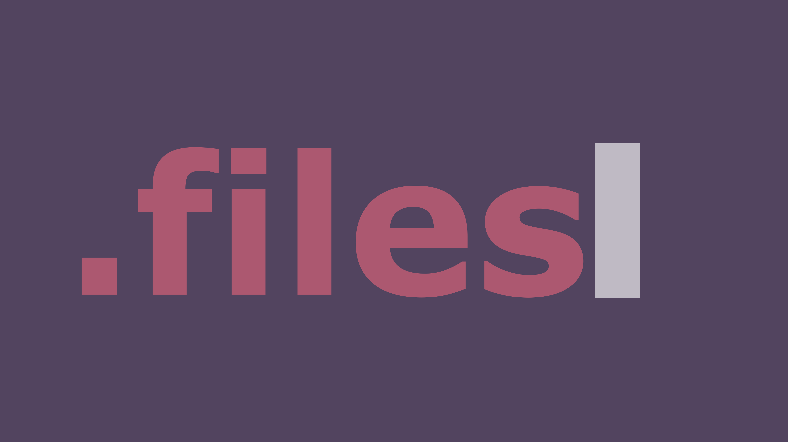
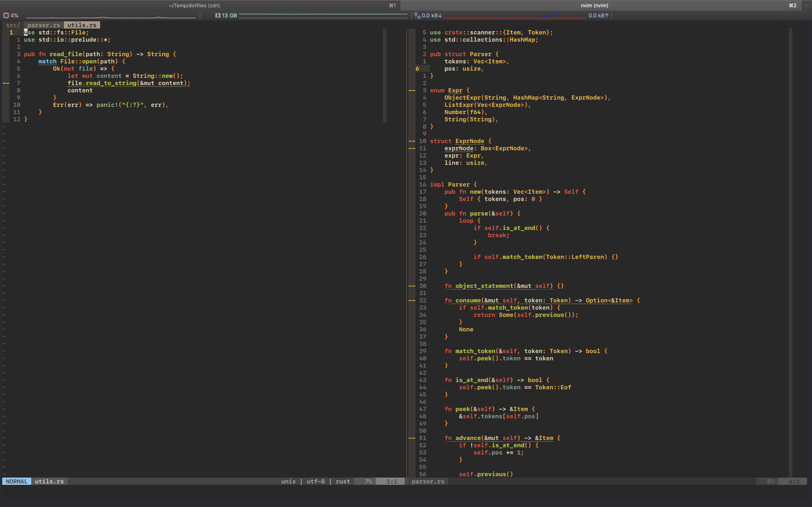

# 📄Dotfiles

<p align="center">
  
</p>

# Usage / Installation

## Deploy configs

```bash
git clone https://www.github.com/HallerPatrick/dotfiles.git ~/.dotfiles
cd ~/.dotfiles
./install
```

This will clone all dotfiles and create symlinks to their according place, powered by
[dotbot](https://github.com/anishathalye/dotbot)

### Shell Configuration

### Terminal

*iTerm2* for Mac.


[Alacritty](https://github.com/alacritty/alacritty) for Ubuntu

Install:

```bash
add-apt-repository ppa:mmstick76/alacritty
apt install alacritty
```

### Powerlevel10k

[Powerlevel10k](https://github.com/romkatv/powerlevel10k#oh-my-zsh) is a zsh theme, that is easily set up.

Run:
```bash
git clone --depth=1 https://github.com/romkatv/powerlevel10k.git $ZSH_CUSTOM/themes/powerlevel10k
source .dotfiles/zshrc # Or your .zshrc config location
```

### Shell Autocompletion

Includes autocompletion from [zsh-autosuggestions](https://github.com/zsh-users/zsh-autosuggestions)

```bash
git clone https://github.com/zsh-users/zsh-autosuggestions ${ZSH_CUSTOM:-~/.oh-my-zsh/custom}/plugins/zsh-autosuggestions
```

zshrc config already includes:

```bash
plugins=(zsh-autosuggestions)
```

# Things I Use

A curated list of all possible apps and features I use:

### Command Line

* [Zsh](https://www.zsh.org/), shell (now MacOS default)
* [iTerm2](https://iterm2.com/), goto command line for MacOS
* [ohmyzsh](https://github.com/ohmyzsh/ohmyzsh), Zsh configurations
* [Powerlevel10k](https://github.com/romkatv/powerlevel10k), Zsh Theme
* [Apple Font SF Mono](https://developer.apple.com/fonts/), Font used for iTerm2

### Utilities

* [Alfred](https://www.alfredapp.com/), better Spotlight
* [Magnet](https://magnet.crowdcafe.com/), Window Manager
* [BetterTouchTool](https://folivora.ai/), Customization for MacOS (mainly used for Mac TouchBar)
* [aerc](https://aerc-mail.org/), Command Line Email Client
* [neovide](https://github.com/Kethku/neovide), Neovim Client used on Windows Systems
* [LiteIcon](https://freemacsoft.net/liteicon/), Custome System Icons
  * [Terminal Icon](https://github.com/dhanishgajjar/terminal-icons)
* [SlowQuitApps](https://github.com/dteoh/SlowQuitApps), Quit Apps Slooowly
* [Thor](https://github.com/gbammc/Thor), Shortcuts manager for your Apps (MacOS)
* [Zathura](https://pwmt.org/projects/zathura/), PDF Viewer
* [VSCode](https://code.visualstudio.com), a non-vim Editor
  * [Latex Workshop](https://marketplace.visualstudio.com/items?itemName=James-Yu.latex-workshop), Latex Plugin with Hot Reload
  * [Vim Emulator](https://marketplace.visualstudio.com/items?itemName=vscodevim.vim), kinda like VIM but not the same
* [vimr](https://github.com/qvacua/vimr) A nice Vim GUI for MacOS

# Homebrew

 Install all brew packages

```bash
bash scripts/brew.sh
```

## i3

Using a basic i3/i3status config.

But "requires" Font Awesome:

*Debian*
```bash
sudo apt-get install -y fonts-font-awesome
```


# Screenshots

## iTerm2 / Neovim

